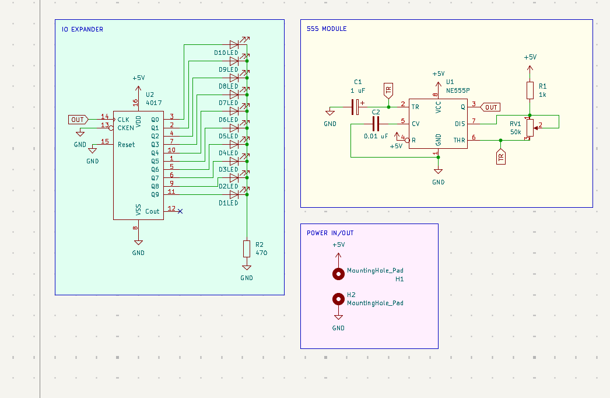
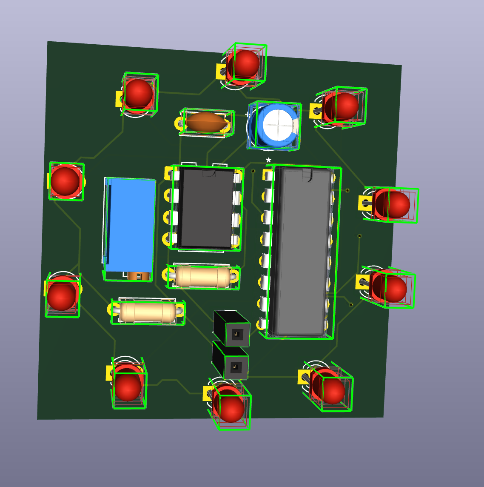
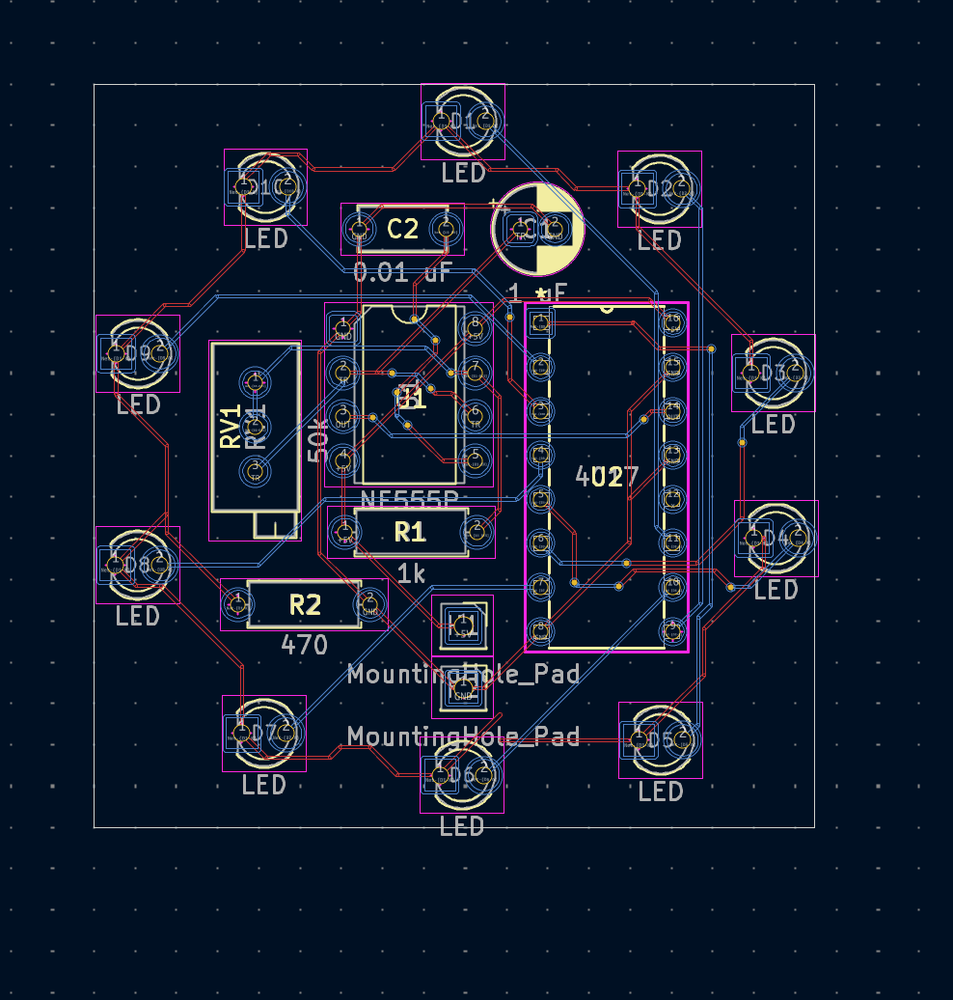
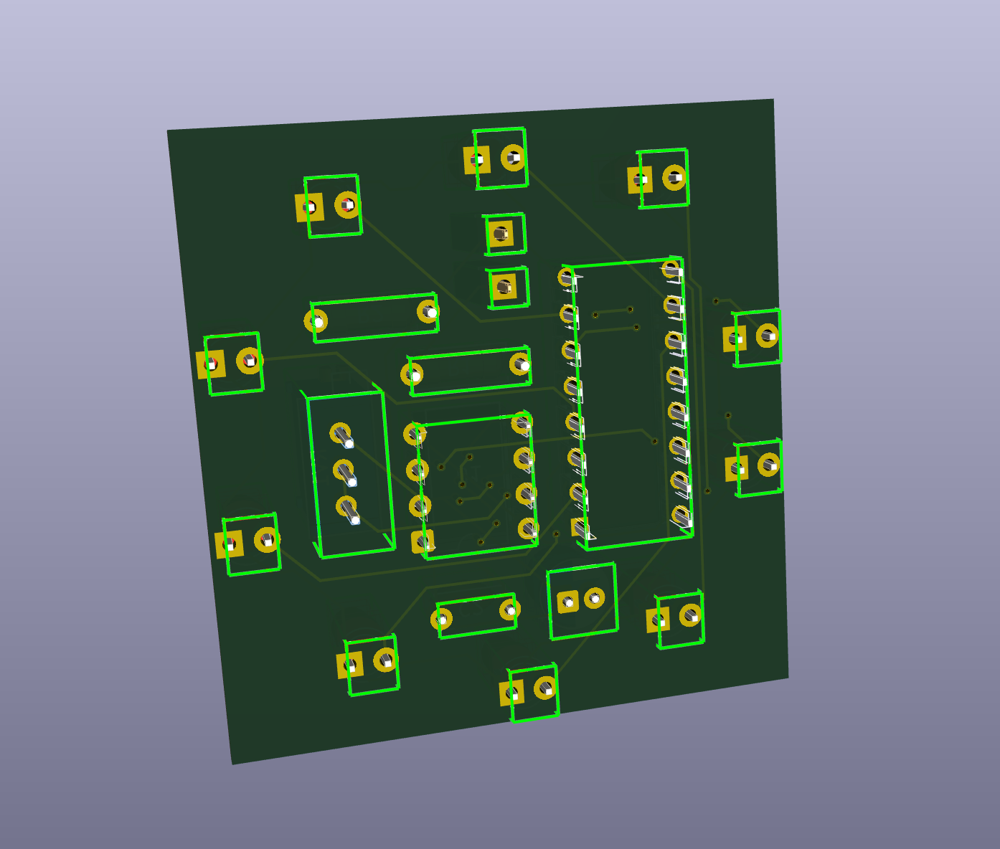

# Chaser
A simple LED chaser board using a 555 IC. Ten LEDs will blink in sequence. I created a custom PCB in KICAD,and I created it to improve my KICAD skills and gain more experience soldering

## Schematic

### S1

## PCB

